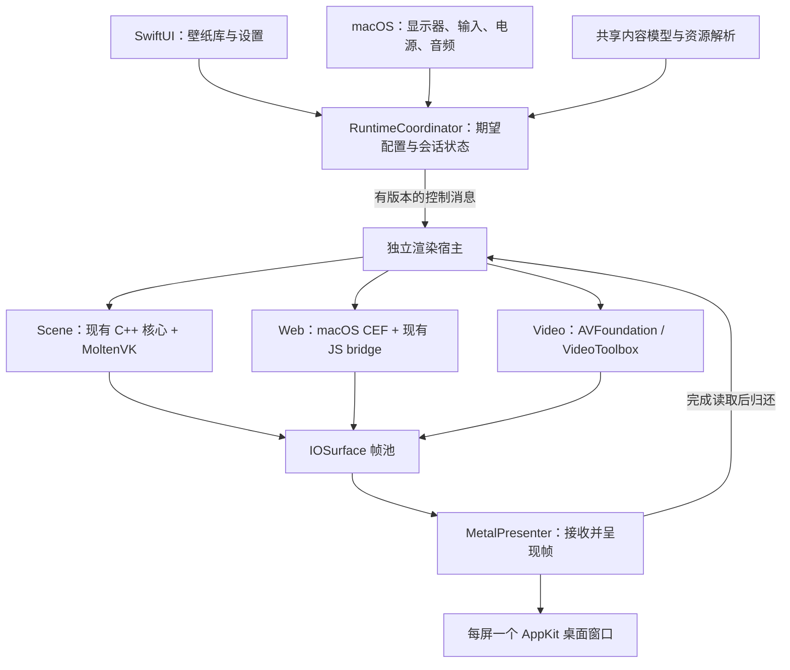

# Vivid macOS 移植方案（已批准，P0 实施中）

状态：已确认以 Vivid 及其原 scene 核心为唯一兼容基线；scene 与全部递归子模块已恢复；已开始 macOS 宿主实现。

审查基线：仓库提交 `68f3b07`，2026-09-18。

2026-09-18 恢复更新：与本地快照对应的 scene 提交 `0986aa4e48540eb9ec75786bde88e458ff7dc422` 已恢复到原子模块路径，全部递归子模块版本与工作树核对通过。源码审查发现 geometry shader 与 MoltenVK 的能力冲突；尚未验证 macOS 编译或运行。证据、依赖清单和恢复结果见 [Scene 源码溯源与依赖恢复记录](scene-source-investigation.zh-CN.md)。

本轮交付：技术方案、设计约束、验证关卡、验收条件、已恢复的原 scene 和递归子模块，以及 macOS 原生宿主、GPU 图像与 XPC/IOSurface 探针。scene C++ 输出尚未接入 Metal presenter。逐项结果见 [P0 验证记录](macos-p0-validation.zh-CN.md)。

## 1. 目标与建议范围

目标是将 Vivid 已有的 Wallpaper Engine 兼容能力移植到 macOS，形成可长期维护的原生应用。以真实壁纸的画面、脚本、用户属性和鼠标行为为验收对象，不能把“窗口能播放动画”视为完成移植。

已确认的项目路线：沿用 Vivid 和其固定版本的 `ayasa520/wallpaper-scene-renderer`，以 Linux 原行为作为兼容基线。Mac 平台差异在明确的模块边界内解决；不引入其他 Wallpaper Engine 兼容核心，也不安排替代核心选型。遇到能力冲突时先分析当前实现、完善等价算法和验证方案。

已批准的首版范围如下；功能分期与分发方式仍按 P0 验证：

| 项目 | 建议 | 原因与代价 |
| --- | --- | --- |
| 硬件 | Apple Silicon 原生 arm64（M1、M1 Pro 及后续 M 系列） | 明确排除 Intel；先控制 GPU、驱动和依赖组合 |
| 系统 | macOS 26.0 起 | 运行时拒绝更早系统；系统音频响应按 macOS 26 实际 API 和权限验证 |
| 内容 | scene、web、video，本地目录导入 | 复用现有内容分类；Windows application / `.exe` 壁纸不在范围内 |
| 桌面 | 多显示器独立配置，同一显示器在普通 Spaces 使用同一配置 | 首版不做跨屏拼接、跨屏渲染实例共享或每个 Space 单独配置 |
| 交互 | scene 移动与左键；web 移动、按钮与滚轮 | 正常桌面下点击与 Finder 共存是验证关卡，不能以预览窗口交互替代 |
| 显示 | SDR；默认 30 FPS，可选 60 FPS | HDR/EDR 输出另立颜色方案；场景内部 HDR 后处理保持现有语义 |
| 分发 | 签名、公证的独立 `.app` / DMG | 首版不以 Mac App Store 为约束；所需权限仍按功能申请 |
| 内容获取 | 用户选择已拥有的壁纸和公共 assets | 不把 Steam 下载器作为移植前置工作 |

“兼容”指通过指定样本与功能矩阵，不承诺全部创意工坊内容都可运行。完整版范围包含音频响应；可先交付不含音频的内部里程碑，不能据此宣称完成全部兼容。

## 2. 已确认事实与待验证假设

以下为当前源码事实，不是运行结果：

| 事实 | 依据 | 对移植的影响 |
| --- | --- | --- |
| scene gitlink 及全部递归子模块已恢复 | [溯源与恢复结果](scene-source-investigation.zh-CN.md)：原快照 226 个普通文件与上游一致，scene 固定 `0986aa4e...`，共 12 个依赖仓库引用匹配且工作树干净 | 保持固定基线；接下来验证平台构建和运行等价性 |
| scene 输出指定 DMA-BUF | [`vivid_scene_producer.cpp`](../producer/src/renderers/scene/vivid_scene_producer.cpp)，`prepare_buffers` / `RenderInitInfo` | 需要新增输出后端，不能只新增桌面 consumer |
| 核心有外部交换链工厂，但返回类型仍依赖 Linux 句柄 | 固定核心中的 `SceneWallpaperSurface.hpp`、`VulkanExSwapchain.hpp` 和 `ExSwapchain.hpp` | 在设备、资源表示和同步契约处重构；只换工厂回调不足以支持 IOSurface |
| 核心强制 geometry shader，粒子/rope 实际使用 | 核心 `Device.cpp`、`WPSceneParserParticle.cpp`；[MoltenVK 能力核查](scene-source-investigation.zh-CN.md) | 原实现无法直接在 MoltenVK 初始化；需设计等价的粒子几何展开并验证效果 |
| 进程与同步依赖 Linux | [`vivid_renderer_host.c`](../producer/src/renderer_host/vivid_renderer_host.c)、[`vivid_renderer_release_timeline.c`](../producer/src/renderer_host/vivid_renderer_release_timeline.c)、[`vivid_renderer_transport.c`](../producer/src/renderer_host/vivid_renderer_transport.c) | eventfd、prctl、DRM syncobj 和当前 socket 标志均需平台实现 |
| 现有协议携带 Linux 图形语义 | [renderer 协议](renderer-protocol-reference.md)、[display 协议](protocols-reference.md) | 复用控制语义；macOS 帧传输另设有版本的协议，不伪造 DRM 字段 |
| scene 查找固定 Steam assets 目录 | [`vivid_scene_project.hpp`](../producer/src/renderers/scene/vivid_scene_project.hpp)，`resolve_assets_path` | 应显式配置资源根目录 |
| scene 与 web 的输入能力不同 | [scene manifest](../producer/src/renderers/scene/vivid-scene.renderer.json)、[web manifest](../producer/src/renderers/web/vivid-web.renderer.json) | 按能力路由事件；不能假设 scene 支持滚轮或全部按钮 |
| web 有现成兼容桥 | [`vivid_web_bridge_js.h`](../producer/src/renderers/web/vivid_web_bridge_js.h) | 保留属性、暂停、音频和媒体回调语义 |
| web 初始化采用 Linux 运行方式 | [`vivid_web_producer.cpp`](../producer/src/renderers/web/vivid_web_producer.cpp) | macOS 主循环、helper bundle、沙箱和纹理路径需重新设计 |
| 视频依赖 GStreamer CUDA/VA/DRM | [video CMake](../producer/src/renderers/video/CMakeLists.txt) | 替换解码与输出后端，不把这些 Linux 依赖带到 Mac |
| 音频频谱已有特定兼容算法 | [`vivid_media_bridge.cpp`](../consumer/kde/src/qml_module/vivid_media_bridge.cpp)、[`display-helper.js`](../consumer/gnome/extension/shell/helper/display-helper.js) | 移植现有 Bluestein 与频带映射，不能直接换成常见的 Hann 窗 FFT |

本机 SDK 头文件确认存在桌面窗口层级、事件观察、IOSurface 的 XPC/Mach 传递接口。当前 macOS 宿主在运行时检查 arm64、macOS 26 和 Metal 设备；这只能证明前置条件，不代表桌面行为、权限组合和 scene 运行效果已完成。

尚未验证的四个关键假设：

1. 已定位的 scene 核心在分离 Linux 构建依赖、适配设备能力并实现必要的 geometry shader 替代后，能在 arm64 macOS 保持目标样本的效果。当前原实现直接运行 MoltenVK 已知不可行。
2. scene 的 GPU 输出能与 IOSurface 互操作，跨 API 可见性和生命周期可以正确实现。
3. 所选 macOS CEF 版本能在计划的独立宿主中运行，并以 GPU 路径交付画面。
4. 使用公开 API 可以达到所需的桌面层级和点击语义。

它们必须在 P0 形成证据；验证失败时修改方案，不能把假设写死后不断加平台特判。

## 3. 架构决策

### 3.1 原生宿主与现有兼容核心分层

采用 SwiftUI 管理界面、AppKit 桌面窗口、Metal 呈现；保留 C++ scene 兼容逻辑和 CEF JS bridge。macOS 运行协调器替代 Linux producer 的平台职责，不整体移植现有 daemon。首个实现阶段已建立 `macos/` SwiftPM 目标：运行时前置检查、每显示器桌面窗口、显示器热插拔/缩放同步代码、按需 Metal 呈现和静态图像诊断源。静态源不启用周期定时器；真实 scene 默认 30 FPS 的目标不变。`--project` / `--scene` 现已按项目类型连接 scene、video 或 CEF 后端，见本文末尾的实现决策。

原因是现有 daemon 同时拥有 DRM 设备、buffer 协商和 Linux 子进程控制。逐个添加 `#ifdef __APPLE__` 会让平台差异贯穿整个生命周期。新宿主只复用明确的业务契约与可提取算法。



Swift 不直接接触 C++ 容器、Vulkan 句柄或 GLib 对象。进程内桥接使用小范围的 C ABI / Objective-C++，异常在桥接边界转换为结构化错误。保持现有 GLib 等核心依赖是可接受的，不为“原生”二字同时重写兼容逻辑。

### 3.2 渲染路线

Scene 首选复用原兼容核心并评估 Vulkan + MoltenVK。保持场景图、文字布局、脚本、粒子仿真和绘制顺序；替换设备初始化、输出、同步和解码适配，并在 `ParticleRenderPlan` 边界设计 geometry shader 的等价展开路径。现有 IndexedQuad 只适用于原材质没有几何阶段的情况，不能作为通用替换。标准 sprite 可评估实例化四边形，rope/trail 必须先明确原 shader 的曲线与细分语义；作者自定义 geometry shader 的覆盖范围需要单独定义。原生 Metal 重写属于另一个项目量级，只有关键能力无法适配时才重新评估。

Web 保留 CEF。macOS 版重做主循环与 helper 包装，JS bridge 保持一份源码。WKWebView 与 Chromium 的行为差异会扩大兼容工作，不作为首版网页壁纸引擎。

Video 首选 AVFoundation / VideoToolbox。播放时钟由媒体时间控制；scene 内的视频纹理使用同一解码适配契约接入，但允许核心保留自己的时间轴。FFmpeg 仅在样本证明存在必须支持的格式缺口后引入，不能用“系统支持视频”推导全部 Wallpaper Engine 视频可播放。

### 3.3 进程组织与 XPC 验证边界

应用进程拥有所有 NSWindow、显示器配置和用户状态，渲染宿主只负责内容运行与离屏输出。

首选以 bundle 内的 XPC 服务分别承载 scene、web、video。每种服务内部支持多个独立 session，不假定创建多条 XPC connection 就会获得多个进程。这个取舍意味着同类服务崩溃可能影响该类型的多个屏幕，但界面与其他类型继续工作。

CEF 是否适合直接放入 XPC service 必须在 P0 验证：AppKit 主循环、GPU 子进程、Chromium helper、服务生命周期、签名、公证后的启动均需覆盖。若需要独立 AppKit helper app，必须先补充并评审其启动、连接建立、认证与退出设计，再开始该部分生产代码；禁止临时加入 launchd 常驻代理、全局端口扫描或反复重启脚本。

控制通道使用 XPC；IOSurface 使用真正的 XPC 对象或 Mach 权利传递。`IOSurfaceID` 仅可用于诊断，不能替代跨进程对象传递和引用所有权。

首版一屏一个 session，独立渲染相同壁纸也视为两个 session。跨屏复用可以降低成本，但会引入输入归属、多消费者归还和不同刷新率协调，暂不实现。

## 4. 模块责任和代码组织

建议目录表示后续生产边界。当前 P0 代码集中在 `macos/Sources/` 和 `macos/Probes/`，尚未一次性建立下列全部模块：

```text
core/
  project/             项目描述、属性、资源引用的规范模型
  layout/              尺寸与坐标变换的纯算法
  audio/               从现有实现提取的频谱算法
macos/
  App/                 SwiftUI、RuntimeCoordinator、配置存储
  Desktop/             AppKit 窗口、显示器与 Spaces 事件
  Presentation/        MetalPresenter、帧租约与呈现时钟
  Services/            XPC 契约、服务宿主与生命周期
  Input/               事件采集、坐标适配、输入模式
  Media/               音频采集、解码和媒体信息适配
  Bridges/             C ABI / Objective-C++ 边界
  Packaging/           bundle、签名、公证与依赖清单
producer/src/renderers/
  scene/               Linux 适配；核心共享部分按边界提取
  web/                 Linux 适配与唯一的 JS bridge 源码
  video/               现有 Linux 视频后端
producer/third_party/
  wallpaper-scene-renderer/  固定版本、可审计的核心依赖
```

| 模块 | 唯一负责的内容 | 禁止承担的内容 |
| --- | --- | --- |
| ProjectCatalog | manifest 规范化、资源根、属性描述 | 创建 GPU、操作窗口 |
| RuntimeCoordinator | 用户期望配置、状态迁移、重建事务 | 直接修改 shader、直接回收在用纹理 |
| DesktopController | 屏幕到窗口的映射、原生窗口行为 | 解释 `scene.pkg` 或代替渲染器裁剪场景 |
| InputRouter | 输入资格、坐标与按钮序列 | 在渲染后修正画面、为特定壁纸改坐标 |
| RendererAdapter | 内容加载、更新、能力报告、输出完整帧 | 探测 Finder、读取应用偏好设置 |
| FramePool | slot 所有权与 generation 生命周期 | 播放策略、UI 状态 |
| MetalPresenter | GPU 接收、全帧呈现、完成读取后归还 | 启动解码器、重试内容解析 |
| SystemFacts | 电源、会话、窗口等观测结果与可信度 | 自行决定恢复用户暂停的壁纸 |

共享模块按实际复用提取，不先制造通用插件框架。Python 壁纸元数据逻辑与 scene 属性解析迁入规范模型前，先保存行为样本；Mac UI 读取同一份规范描述，避免 Swift、Python、C++ 各自解释属性类型。

Linux 入口继续工作。提取共享模块时先接回原调用点并验证等价，再加入 Mac 调用者。暂时未迁移的旧实现必须标注替换阶段，不能变成永久的两套事实来源。

## 5. 状态、接口与线程模型

### 5.1 状态的唯一来源

每个显示配置具有一个稳定 `displayKey` 和独立 session。`displayKey` 根据系统显示标识生成，不能持久化数组下标或运行期 `CGDirectDisplayID`。显示 UUID 在部分虚拟屏、扩展坞上不稳定时，标记身份不确定并允许重新绑定，不能凭同名显示器自动覆盖用户配置。

由 RuntimeCoordinator 的串行执行域拥有以下状态：

- `DesiredConfig`：用户希望的项目、属性、FPS、填充方式、音量等；具有递增 revision。
- `AppliedState`：渲染器明确确认的 revision、运行状态和诊断；不作为第二份用户配置。
- `SystemFacts`：带来源与时间的观测；无法获得的数据为 unknown，而不是 false。

用户选择被保存不等于渲染成功。界面分别显示“已选择/加载中/运行失败”，切换失败可以继续展示上一张完整画面，同时明确当前选择尚未生效。

生命周期：`Idle → Loading → Ready → Running / Paused → Draining → Closed`；任何活动状态可进入 `Failed`。项目替换通过新 session 的加载事务实现；只有其首帧有效后才替换旧画面。GPU 设备属于服务中的可复用设备上下文，新 session 不意味着重建整台设备。

每个显示输出最多一个当前 session 和一个候选 session。快速连续选择只保留最新候选，取消的候选先完成必要清理，不无限并发加载。候选失败时保留旧 AppliedState 与画面，DesiredConfig 保留用户最新选择并显示失败；不能悄悄把旧项目重新保存成用户选择。RuntimeCoordinator 统一预留切换预算，预算不足时不开始事务。

### 5.2 最小控制契约

| 操作 | 输入 / 结果 | 规则 |
| --- | --- | --- |
| OpenSession | 项目、资源根、输出尺寸、初始配置；返回 capabilities | 初始化失败返回明确 stage/code |
| ApplyConfig | 完整的运行配置快照与 revision | 较旧 revision 不覆盖较新配置；修改合并只发生在宿主 |
| SetPlayback | playing、muted、volume | 暂停与静音为不同维度 |
| InputBatch | 显示映射 revision、事件序号、坐标、按钮/滚轮 | 过期映射事件不能落到新的几何布局 |
| AudioFrame / MediaState | 128 个频谱值 / 可用的媒体字段 | 能力不支持时不发送；缺失字段不伪造 |
| BindPool / PoolAccepted | generation、尺寸、像素格式、颜色描述、IOSurface 对象 | 接收端导入全部资源成功后才允许发布帧 |
| FrameReady / ReleaseFrame | 完整帧 token | 按第 6 节所有权执行 |
| Drain / Close | 停止新工作、释放完成结果 | 幂等；不能将超时视为 GPU 完成 |

包络包含协议版本、进程 incarnation、sessionId 和 requestId。控制消息有有界载荷和 schema 校验；结构化解码结果才进入核心。连接限定为应用 bundle 内受控服务，验证预期对端身份，不开放全局控制入口。初版只支持一种明确的 macOS 协议版本，不做未经使用的多版本协商框架。

现有 Linux wire protocol 保持独立。未来若统一，必须修改 TOML 源定义并重新生成绑定；不直接手改生成文件。

### 5.3 线程分工

- AppKit、SwiftUI 和窗口变更在主线程；主线程不能等 GPU、读大文件或执行 IPC 同步等待。
- RuntimeCoordinator 通过 actor / 串行队列处理状态；异步调用返回后再次核对 session 和 revision，防止 actor 重入导致过期提交。
- 每个渲染 session 的核心状态由一个明确的串行执行域拥有；scene 已有渲染线程的情况下，桥接只投递命令，不重复建立另一套核心锁。
- CEF 按所选版本的 macOS 主循环要求运行；不复用 Linux 的 `multi_threaded_message_loop = true` 假设。
- GPU 完成回调只把结果送回所属队列，不能跨线程直接改 SwiftUI 或帧池状态。
- 音频实时回调只写预分配环形队列；FFT、IPC、日志和内存分配放到非实时线程。

## 6. GPU 输出、同步与内存算法

### 6.1 输出契约

每个渲染器输出已经按目标 framebuffer 尺寸完成布局的画面。Scene 的 camera/fill、web viewport 和 video letterbox/crop 分别在适配器内完成。Presenter 只呈现整帧，不再次执行内容裁剪。

公共输出首选 8-bit BGRA、SDR/sRGB；是否需要保留 RGBA 由 P0 的真实格式支持决定。帧池描述必须携带 format、color space、transfer function、alpha mode 与原点方向。后端在输出边界做一次必要转换；格式和方向转换必须由契约驱动，禁止在截图或 UI 层临时交换 R/B、翻转图像或叠加 gamma 补偿。

Scene 内部线性光照、HDR 中间目标和后处理保留原语义；最终输出转换需与 Linux 基线对照。视频在输出适配器根据原视频色彩元数据转换到公共契约，不能把 YUV 数据直接解释为 sRGB。

### 6.2 选择三槽帧池与 GPU 完成通知

首版每个 session 固定三个共享输出 slot。worker 分配 IOSurface，并为实际图形 API 创建视图。MoltenVK 所需的图像共享、usage、layout 与可见性屏障必须在 P0 证明；“共享了内存”不等于“无需同步”。

首版跨进程同步不要求 Vulkan semaphore 与 Metal event 互通：

1. worker 获得 `Free` slot 后提交渲染/输出拷贝。
2. 后台完成路径确认生产者 GPU 工作和所需内存可见性操作结束，再发 `FrameReady`。
3. app 导入共享纹理，用 Metal 复制到自己拥有的呈现纹理。
4. Metal command buffer 完成读取后发 `ReleaseFrame`；worker 此时才能重写该 slot。

CEF 回调提供的 GPU 资源与服务自有帧池是两种所有权。必须根据选定 CEF 版本确认回调资源的有效期及生产者同步要求，在有效期内完成合法的保留或复制；仅保存句柄、甚至只 retain IOSurface，都不代表 Chromium 不会复用其内容。若该版本无法提供可证明的 GPU 生命周期路径，应更换已验证的版本/路线并更新设计，不能退回持续软件绘制而继续声称 GPU 输出。

Vulkan 等待 fence 的工作只允许在后台执行域进行，不能每帧 `vkDeviceWaitIdle`，不能主线程 `waitUntilCompleted`。未来如需共享 GPU event 优化，必须以测量证明同步通知成为瓶颈，再替换同步后端。

这个方案接受一次从共享池到应用呈现纹理的 GPU 拷贝；某些后端还需要一次归一化输出拷贝，两者要分别测量。收益是应用能安全保留上一帧，也不会长期占用 worker 的共享 slot。持续 CPU readback/upload 不进入发布路径。

### 6.3 slot 所有权状态机

正常状态：`Free → Writing → ReadyLeased → Reading → Free`。

`ReadyLeased` 表示通知已经发布、app 拥有归还责任；worker 即使发现“通知没被及时处理”也不能覆写。app 丢弃尚未提交 GPU 的 ready 帧，可以立即归还；已经提交读取的帧只能在 GPU 完成后归还。

每帧 token 为 `(processIncarnation, sessionId, generation, slot, sequence)`。接收端按完整 token 去重；旧进程、旧 generation、重复或无效归还不能释放当前 slot。

app 每个 session 最多保留一个尚未处理的 ready 帧，新帧替换它时归还被替换的帧。worker 没有 Free slot 时跳过本次输出，不额外分配缓冲、不覆盖在用帧。这是有界背压，不能用无上限队列吸收速度差。

app 的呈现纹理采用有界双缓冲，并在同一 Metal command queue 上按读写依赖排序；上一张完整纹理保留到新拷贝成功。Presenter 从自有纹理绘制到 CAMetalLayer drawable，由系统接管 drawable 呈现。不能在绘制命令尚在读取时重写源纹理，也不能提前将未完成的新纹理标记为当前画面。接收拷贝一次最多一个在途任务，没有可用目标时继续保留最新 ready 帧并施加背压。

### 6.4 重建、崩溃和预算

输出尺寸、格式、render scale 变化会创建新 generation；属性更新不无故重建 GPU 设备。

重建顺序：停止旧 generation 新写入 → 准备并导入新池 → 取得新首帧 → 切换呈现 → 完成旧 GPU 工作和租约归还 → 销毁旧池。同一 session 同时最多一个活动池和一个替换池。连续尺寸通知只保留最新目标；不能并行堆积重建。

新池失败时清理候选资源；旧输出契约仍有效则恢复旧 generation，否则冻结 app 自有完整画面并报告失败。新的 LayoutSnapshot 只有在对应输出真正应用后才用于输入；窗口尺寸先改变的过渡期采用明确的临时呈现变换，并暂停按钮路由，避免画面与命中几何不一致。

进程断开时冻结 app 自有的上一张完整画面，废弃旧 incarnation 的后续消息。app 等待自己已提交的 GPU 读取完成后释放引用，失效 worker 的图形上下文交由操作系统/驱动销毁；不等待已退出进程继续回复。不能把进程退出推断为“所有 GPU 工作立即结束”，也不能将旧 slot 放回新池。相关系统对象在上下文销毁期间的引用保证必须作为 P0 崩溃测试的一部分。

仅计算 BGRA 传输池：`3 × width × height × 4`；加上 app 双缓冲约为 `5 × width × height × 4`。3840×2160 时约 158 MiB，还不含 drawable、场景纹理、解码、CEF 与重建期间的额外占用。

创建前根据真实 row stride、池数量、设备限制和已知资源估算校验预算。预算不足返回可理解的资源错误；需要降低 render scale 时由显式质量设置或明确的自适应策略决定，不能偷偷降低质量让“测试通过”。正式预算值在 P0/P1 的目标机测量后冻结。

## 7. 帧调度与播放策略

显示器提供呈现时机，内容后端提供自己的仿真/媒体时钟。Scene FPS 是仿真与绘制上限，Video 按 PTS，CEF 按浏览器节拍；不强行把三者塞进一个固定 sleep 循环。

Scene 的限频使用单调时间与绝对 deadline。每次最多产生一次工作；错过若干周期时直接推进到下一个将来 deadline，不补画过期帧。内部物理或粒子是否需要固定步长由原核心决定，平台层不能另加不兼容的时间步算法。

输入移动在一次内容更新前合并为最新位置；按钮边沿按顺序保留，不能被移动合并覆盖。Video/CEF 的 ready 帧也采用最新帧优先，显示器不主动为同一内容帧触发解码。

暂停时停止周期性渲染、采样和无意义 IPC；配置变化可请求一次重绘，随后继续暂停。系统重绘窗口可以使用 app 自有的最后一帧，不唤醒整个引擎。

播放策略从事实重新计算，不能通过多个观察者互相调用 pause/resume：

1. 用户 stop、锁屏、睡眠和会话不可用首先阻止运行。
2. 用户 pause 持续有效，自动策略消失也不能覆盖它。
3. 应用规则、电池和可确认的全屏事实形成自动限制。
4. 没有限制且用户选择播放时才运行。

音量/静音独立计算，策略仅叠加限制，不覆盖用户保存的音量。恢复采用单个可取消的短暂延迟来吸收状态抖动；延迟是策略的明确部分，并非故障重试。窗口遮挡信息不足时采用 unknown，不声称“精准识别所有全屏/遮挡”。

## 8. 桌面与鼠标交互

### 8.1 原生桌面行为

每个 NSScreen 一个无边框、非 key/main 的桌面窗口；使用完整 screen frame 覆盖桌面，在桌面背景之上、Finder 图标之下选择公开窗口层级。Spaces 行为以 `canJoinAllSpaces`、`stationary`、`ignoresCycle` 为候选组合，最终值以 P0 实测冻结。

不默认加入 `fullScreenAuxiliary`：壁纸不应进入其他应用全屏层前面。Mission Control、Stage Manager、显示桌面、系统桌面小组件、Finder 重启和全屏 Space 必须实测，不能仅检查 NSWindow 属性。

监听显示器变化并以稳定身份重建窗口映射。跨屏负坐标、Retina、旋转和显示器重新排列都从当前系统数据计算，不固定“主屏在左下角”。

### 8.2 统一坐标算法

所有适配器输出的 framebuffer 约定左上原点、x 向右、y 向下。每个输出保存唯一的 `LayoutSnapshot`，含屏幕 frame、backingScale、renderScale、framebuffer 大小、present rect 和 revision。

从 `NSEvent.mouseLocation` 得到 AppKit 全局点 `(x,y)`；对屏幕 `(sx,sy,sw,sh)`，局部点为 `(x-sx, sy+sh-y)`。再经过该输出的 backing/呈现变换逆矩阵，得到 framebuffer 坐标。不要把 Core Graphics 事件坐标直接当作 AppKit 坐标，源 API 的转换由 InputAdapter 完成。

布局用一个明确的二维仿射矩阵表示；呈现和命中使用同一变换及其逆，不在多个回调里分别乘 scale 或翻转 y。普通桌面全帧呈现不额外做内容 crop；scene 内的 camera/fill 由引擎处理，防止裁剪两次。

需要 fit/cover 的视频输出或预览布局采用标准公式：

- fit：`scale = min(dstWidth/srcWidth, dstHeight/srcHeight)`；
- cover：`scale = max(dstWidth/srcWidth, dstHeight/srcHeight)`；
- 中心偏移：`((dstWidth-srcWidth*scale)/2, (dstHeight-srcHeight*scale)/2)`。

命中先判断目标区域，再求逆；黑边或屏幕外输入应为 outside，不能全部 clamp 到边缘伪装成有效点击。Scene 最终按 framebuffer 大小归一化到它现有的 `mouseInput` 接口；web 按实际 CEF viewport 的 DIP 坐标转入。

### 8.3 点击策略与发布门槛

鼠标跟随与按钮路由分开：

| 模式 | 行为 | 验证要求 |
| --- | --- | --- |
| 跟随模式 | 桌面窗口穿透；读取位置驱动视差，不发送点击 | Finder、拖拽与普通应用操作不受影响 |
| 桌面交互模式（目标） | 保持桌面操作；仅符合桌面输入资格的事件传给壁纸 | 不能把普通应用按钮、菜单或 Finder 图标点击误判为壁纸按钮 |
| 显式交互预览 | 在应用自己的预览窗口接收完整事件 | 可作为调试/辅助功能，不能代替桌面交互验收 |

全局事件观察不会自动提供“点到了桌面空白”的结论；前台应用是 Finder 也不足以证明。P0 必须验证窗口命中、Finder 图标/空白识别和实际所需权限，记录有权限、无权限及权限撤销三种结果。

若公开 API 无法可靠满足目标，应向用户明确报告限制并重新评审交互产品行为。不能未经确认将目标缩成跟随模式，也不能加入私有 API 或持续调整窗口层级来伪造通过。

InputRouter 保存已发送的按下集合。退出交互、切换 session、锁屏、失去输入资格时，向旧 session 发对应 release/cancel；恢复资格时不能凭当前物理按键状态制造新的按下。防止引擎中的按钮永久卡住。

事件携带几何 revision；重建期间的旧坐标丢弃并结束旧按键序列。按钮前先更新同事件坐标，与现有 producer 的语义保持一致。滚轮按 source、方向与单位规范化；只发送给声明支持的后端。

不预设所有鼠标 API 都需要辅助功能权限。跟随先验证系统公开位置接口；高级监听或命中确需权限时单独说明用途。用户拒绝不应使无关渲染功能失效。

## 9. 内容导入、属性与资源

ProjectCatalog 接收显式的项目根和公共 assets 根，输出规范化 ProjectDescriptor。Steam 目录扫描只是一种导入便利，不作为引擎寻找资源的隐含前提。

导入时验证 `project.json`、类型、入口和引用根；scene 支持现有 `.json` / `.pkg` 推断语义，缺少公共 assets 要准确报告。路径解析负责相对路径、分隔符与大小写差异，不能通过全局转小写破坏原路径。出现不唯一的大小写匹配时报告冲突。

资源查找顺序固定为项目资源和显式公共资源根；如果核心使用虚拟文件系统，在该边界扩展。外部文件型用户属性作为独立授权资源引用，不允许以不受控的 `../` 绕过根目录。文件访问策略需与真实壁纸兼容样本一起验证。

属性描述只解析一次，保留 bool、数字、字符串、颜色、combo、文件和目录等原有类型。UI 只是编辑规范值，不根据显示文本重新推断类型。运行配置以 revision 快照传递，快速拖动滑块可以合并尚未发送的更新；最终值必须得到 applied 确认。

配置采用有 schemaVersion 的 JSON，写临时文件并原子替换；迁移失败保留原文件并报告，不用 reset-defaults 掩盖。原始壁纸保持只读，用户设置、缓存和 shader 产物写入应用自己的目录。

首版库扫描为有界后台任务；初次遍历 O(条目数)，后续按受影响目录增量刷新。缓存依据 manifest 和相关资源版本失效，禁止 UI 每刷新一次就递归扫描全部 Steam 库。

## 10. 音频、视频与媒体信息

### 10.1 音频采集与兼容算法

macOS 26 起按实际可用的 Core Audio Process Tap API 验证系统输出采集，并明确排除本应用及渲染子进程，避免壁纸自激反馈。设备与进程列表变化需更新采集契约；权限或 API 行为不满足时，单独评审 ScreenCaptureKit 路线及其权限行为。

保持实际采样率，不能为了方便强制重采样到 44.1 kHz。现有 KDE/GNOME 算法包含以下兼容选择，Mac 应从中提取一份可测试核心：

- 每声道输出 64 个频带，合计 128，顺序为左声道后右声道。
- 变换长度 `N = trunc(max(sampleRate/44100, 1) × 64 × 30)`，通常不是 2 的幂。
- 采用 Bluestein，将长度 N 的 DFT 转成长度 `M = nextPowerOfTwo(2N-1)` 的卷积，复杂度 O(M log M)、工作内存 O(M)。
- 保留已实现的 PCM 编码、有效采样前缀、频带分组、权重和输出增益；不新增 Hann 窗、随意归一化或把有效结果限制到 1。
- FFT 计划在采样率变化时重建；预分配左右声道 workspace，以约 33 ms 节拍分析最新窗口，无消费者时停止采集。

边界样本必须覆盖 `PCM=-1`（当前倒数编码在该点有奇异值）、NaN/Inf、断流、采样率切换及单声道。先确认现有输出与预期语义，再在输入契约或算法本体处理；不能在输出末尾再套一层“修正频谱”函数。尚未决定的数值边界语义在 P4 实现前冻结。

实时回调使用预分配的单生产者/单消费者环形队列：生产者只发布写入位置，消费者拥有读取位置；满队列时丢弃新块并标记 discontinuity，分析端重建连续窗口，不能同时让两个线程修改同一读取索引。

权限拒绝、设备断开或无采集数据时报告状态，停止采集并按协议提供静默值。正常渲染仍可运行。

### 10.2 解码和媒体元数据

视频按显示请求取得对应 PTS 的帧；晚到的旧帧丢弃，暂停时冻结媒体时钟。CVPixelBuffer、CVMetalTexture 与解码输出在 GPU 读取完成前保持引用，不能只保留裸纹理指针。

循环接缝、seek、暂停恢复和 scene 视频纹理时间轴分别测试。scene 内视频纹理的 Vulkan/Metal 互操作同样属于 GPU 路径验证，不能把独立播放器成功当作这部分完成。

macOS 没有可直接等价替换 MPRIS 的通用公开媒体信息总线。首版只报告有受支持来源的数据；曲名、封面或播放状态不可获取时标记 unavailable，不使用私有 MediaRemote 接口承诺全应用支持。媒体元数据缺失不应影响系统音频频谱。

## 11. 失败处理与诊断

| 失败 | 处理 | 禁止的处理 |
| --- | --- | --- |
| 格式或 shader 能力不足 | 返回 UnsupportedCapability，记录具体能力和后端版本 | 自动全局关闭效果来隐藏错误 |
| 项目加载失败 | 保留旧完整画面，显示目标项目失败原因 | 修改用户原壁纸或无提示换壁纸 |
| frame pool 导入失败 | 终止本 generation，清理已成功导入的资源 | 混用部分成功的新池与旧池 |
| GPU 超时/设备异常 | 停止提交，进入 Failed，保留诊断 | 超时后把在用 slot 标成 Free |
| helper 意外退出 | 会话失效；仅 supervisor 执行有上限的重启 | backend、UI、IPC 各自再加重试 |
| 权限不可用 | 对应能力进入 unavailable | 反复弹授权、重启以绕过权限 |
| 配置过期 | 丢弃旧结果并释放其拥有资源 | 旧回调回写当前配置 |

自动重启仅针对意外崩溃，建议 60 秒内最多两次，退避 0.5 秒、2 秒；连续失败停止，保留手动重试。缺失资源、权限拒绝、协议不兼容不是可自动重试错误。重启是进程恢复策略，不是用来掩盖确定性 bug 的修复方式。

日志携带 session、revision、generation、frame sequence、阶段和错误码。性能计数包含 GPU 时间、待呈现帧数、跳帧、slot 占用、启动和首帧耗时。保留足以重现问题的依赖版本与能力快照，避免每帧打印大量日志。

## 12. 开发规范与禁止补丁堆积的规则

以下规则已经评审确认。macOS 的执行规范见 [`macos/DEVELOPMENT.md`](../macos/DEVELOPMENT.md)，格式配置为该目录下的 `.swift-format` 与 `.clang-format`；scene 子树继续沿用其既有 `.clang-format`。

1. **先写契约再实现。** 每个模块明确输入、输出、状态迁移、资源所有权、线程和失败语义；关键假设未验证时不能把实现标记完成。
2. **一项事实只有一个负责人。** 不新增与现有状态相互补偿的布尔值、缓存和计时器。增加状态需说明不能从现有状态推导的原因。
3. **修复发生在错误所属层。** 坐标问题修布局/输入变换，归还问题修所有权状态机，shader 问题修对应翻译或能力实现。禁止在下游补偏移、补色或增加 refresh 重试来遮盖。
4. **允许有边界的平台实现。** 新增函数、适配器和必要抽象本身不是问题；它们必须有独立职责。平台选择集中在构建目标和适配层，禁止条件编译蔓延到业务流程。
5. **保持兼容算法。** 结构重构与渲染代数/音频算法修改分开提交；不能把重命名、迁移和行为改变混在一起而无法回归定位。
6. **用证据决定优化。** 先实现正确的有界流程，测量后再优化 GPU 同步、纹理共享或跨屏实例复用；不以“可能更快”增加第二条生产路径。
7. **RAII 与明确引用周期。** C++ 使用 RAII；Swift/Objective-C 使用明确 capture 和引用生命周期；无裸句柄跨未知生命周期，无跨语言异常传播。
8. **无隐式全局副作用。** 库不能自行启动后台进程、弹权限、修改用户设置；副作用由宿主协调并可观测。
9. **依赖修改可审计。** scene 核心基于记录的上游提交，源码和平台修改直接纳入本仓库，保留来源、许可证和验证记录；第三方库以固定版本子模块管理。不在构建脚本里 sed 第三方源码，不维护层层叠加的临时补丁队列。
10. **删除被替代路径。** 新实现验证后移除旧逻辑；临时诊断代码不能成为自动恢复链。必要的格式/版本兼容必须集中管理、有样本、有删除或长期支持说明。
11. **测试契约和行为。** 为状态机、布局、数值算法和真实兼容写有意义的回归；不堆砌只验证函数转发的测试。
12. **变更可审阅。** 每次变更说明具体问题、算法选择、复杂度/成本、失败影响、验证结果和限制。重大边界变化先更新设计决定。

Swift 使用 swift-format，C/C++/Objective-C++ 使用 clang-format；新代码开启严格告警，第三方告警独立管理。C++ 继续 C++20；当前宿主使用 Swift 6.1+、Swift 6 严格并发模式，并以 `-warnings-as-errors` 验证。不要为格式化整个上游制造无关 diff。

出现缺陷时按固定流程工作：复现 → 找到被违反的契约 → 确定错误负责人 → 修改原实现或边界设计 → 添加最小有效回归 → 删除替代代码 → 运行受影响检查。无法解释根因时记录未解决，不能用“加一个保护函数后不报错”作为完成依据。

## 13. 构建、依赖与发行

核心和渲染桥使用 CMake；生产 app、XPC/helper bundle 仍计划使用受版本管理的 Xcode 工程。当前只有 CommandLineTools，P0 宿主采用 SwiftPM，独立帧传输探针由 CMake 生成带 XPC service 的 bundle 并临时签名；这不替代生产打包、公证和 CEF 宿主验证。后续生产构建先产出核心库再构建 bundle，避免同一文件由两套系统编译。依赖发现不绑定开发者 Homebrew 绝对路径。

记录 scene 核心的上游基线和本仓库修改，固定 MoltenVK/Vulkan headers、CEF、shader 编译器及核心传递依赖的版本、来源和校验。现有脚本引用 `libdxcompiler.so`，必须确认实际 shader 编译依赖的 macOS 构建与发行方式；不能只改成 `.dylib` 名称就认定完成。

开发构建和发行构建使用同一依赖布局。app 包含实际需要的动态库、framework 和资源，使用 macOS 的 rpath/install name；检查包内不存在 Linux `.so`、`$ORIGIN` 或外部开发机路径。

CEF 使用对应版本的 macOS helper、沙箱和签名方案；现有 Linux 的 `no_sandbox = true` 不作为 Mac 版默认配置继承。独立分发不自动意味着关闭 Chromium 沙箱。任何实际需要的 entitlement 都应由签名样本验证。

CI 分三层：纯算法/协议检查、macOS 构建检查、真实 GPU/桌面集成检查。没有图形会话的 runner 无法替代 Finder/Spaces 验收，必须保留物理机测试记录。修改共享算法或核心时同时运行 Linux 回归；只改 macOS UI 时不无意义重跑所有壁纸。

GPL-2.0 代码及第三方许可证随发行审查；分发修改后的二进制时提供符合许可证的对应源码。原版公共 assets 和用户壁纸不默认打包。最后在没有开发依赖的干净 Mac 上验证安装、启动、公证和卸载退出行为。

## 14. 阶段、准入条件与验收

以下为阶段依赖顺序。原核心与递归子模块已恢复；目前已实现 macOS scene 构建、IOSurface/XPC/Metal 桌面输出、标准 sprite 与 rope 的播放路径，以及 scene 内嵌视频解码。真实素材的验证结果见 [Scene 验证记录](macos-scene-validation.zh-CN.md)。这不代表 CEF、系统音频、桌面点击矩阵和独立发行已通过验收，也不据此给出固定工期。

| 阶段 | 工作与交付物 | 通过条件 |
| --- | --- | --- |
| D0：设计评审（已通过） | 本方案、范围与风险 | 已确认 Apple Silicon、macOS 26+、Vivid 原 scene 核心和其余路线约束 |
| P0：关键假设验证（进行中） | 已恢复依赖的 macOS 构建；设备能力/geometry 替代与真实粒子效果；IOSurface 共享与归还；CEF 宿主；桌面点击矩阵 | 四项关键假设有记录；普通场景与粒子/rope 均有对照；无法满足的目标回到设计评审 |
| P1：共享边界与运行骨架 | 内容模型、布局、桥接、协议、会话状态机和受控帧池；最小 app | 契约测试通过；Linux 共享部分等价；无平台依赖反向渗入核心 |
| P2：Scene 桌面闭环（播放链路已实现，完整验收进行中） | 项目路径、assets、属性、渲染、桌面跟随/左键、暂停、单屏生命周期 | 一组真实 scene 与 Linux 对照通过，包括复杂效果；点击符合已评审行为 |
| P3：Web / Video / 多屏 | CEF bridge、系统解码、各屏配置、热插拔和几何切换 | WebGL/音视频/按钮/滚轮样本与视频格式矩阵通过；无错屏、坐标漂移 |
| P4：音频与兼容完善 | 采集、频谱算法、scene 视频纹理剩余项、媒体能力、功耗优化 | 数值差分与真实音频壁纸通过；权限拒绝不破坏其他功能 |
| P5：发行 | 打包、签名、公证、文档、干净机回归 | 硬件/系统支持矩阵有结果，已知限制可见，安装后无需开发环境 |

P0 的实验代码在设计获批后才允许创建，且不能未经整理直接变成生产框架。每个实验只回答一个明确问题；通过后把结论、版本、真实限制和选定 API 写回本文。核心和递归子模块已经恢复，仍需在平台构建、真实 shader 样本和 GPU 路径验证后，冻结 shader、脚本运行时或纹理解码的内部设计。

P0 必须交付的可复核证据：

- 基于已恢复的固定 scene 提交，验证编译依赖可重现、适配接口可链接，并记录构建产物和平台能力。
- 普通 scene、geometry 粒子和 rope/trail 的画面与鼠标行为对照，shader 编译诊断，以及文字/视频纹理所需能力清单；不能只凭无粒子样本通过来关闭 geometry 风险。
- 两进程连续共享 GPU 帧；resize、暂停、接收方变慢、重复消息、进程终止均不重写在用 slot。
- macOS CEF 的正确运行循环、GPU 画面、输入和最终 bundle 宿主选择；不能只测试空白 HTML。
- Finder 图标、空白、窗口覆盖、拖拽、右键、滚轮、菜单、Spaces、Mission Control、Stage Manager、显示桌面的实际行为表。
- 清楚区分 GPU-only 输出路径、允许的 GPU 拷贝和任何仅用于诊断的 CPU 截图。

## 15. 验收方法与性能目标

### 15.1 正确性测试

| 层次 | 核心用例 |
| --- | --- |
| 纯算法 | fit/cover 和逆变换往返；负坐标、Retina、旋转、黑边；属性类型；频谱 44.1/48/96 kHz 与边界 PCM |
| 状态与资源 | ready/release 重复、过期 generation、乱序回调、取消加载、连续配置、暂停时重建、连接断开 |
| GPU 集成 | 测试图像颜色/alpha/方向；共享帧持续切换；慢消费者；resize；纹理资源释放 |
| 内容兼容 | 粒子、文字、骨骼/模型、特效叠加、SceneScript、交互、视频纹理、WebGL、属性变化、音频响应 |
| 系统集成 | Finder 与点击、权限撤销、显示器拔插、不同 scale、锁屏、睡眠唤醒、全屏和 Spaces |
| 发行 | 签名后的 CEF/helper 启动；无 Homebrew 的 Mac；缓存目录可写；退出无孤儿进程 |

视觉比较使用相同项目、属性、尺寸和确定性输入。可控时固定随机种子/时间/音频；不可控动画比较多帧行为和特征，不把自然动画差异判成失败。截图基线来自 Linux 运行结果，公开测试材料应具有可使用的授权。

静态画面采用像素差与感知差异辅助评估，阈值按字体、抗锯齿和样本类别事先固定；不能看到差异后随意放宽。交互单独验证事件顺序和可见结果，不用截图测试替代。

### 15.2 建议指标（待目标硬件基线冻结）

- 默认 30 FPS；标准样本在目标分辨率持续达到配置节拍，60 FPS 作为独立测试组合。
- 统计 CPU/GPU 帧时间 p50/p95/p99，区分内容渲染、GPU 拷贝、呈现等待，不用平均 FPS 隐藏停顿。
- 简单交互样本从输入到对应呈现的 p95 目标不超过两个内容帧周期加一个显示刷新周期；明确测量起终点。
- 自有帧/命令队列严格有界；30 分钟播放和 100 次切换后资源占用收敛，不能随切换次数持续增长。
- 暂停后没有持续的壁纸渲染 GPU 提交、鼠标采样和音频分析；系统要求的窗口重绘单独计数。
- 双屏、4K、不同刷新率和分辨率分别记录功耗、内存和丢帧。温度/耗电以具体机型与实测基线评估，不预先承诺一个通用百分比。

测试通过后，仅在新改动、失败或未解决风险要求时扩大/重复测试。桌面交互、帧所有权、色彩和资源泄漏属于发布阻断项，不能标注“以后优化”后发布。

## 16. 已确认事项与后续约束

1. 首版范围已确定为 Apple Silicon（M1 及后续 M 系列）、macOS 26+，不支持 Intel；系统音频响应和独立分发仍以 P0/P5 验证为准。
2. 复用 Vivid 及其原 scene 核心；原生宿主、MoltenVK、CEF 和系统视频后端的具体适配继续按 P0 证据实现。
3. 一屏一个 session、同类型服务可共享进程，以及三槽共享池 + GPU 拷贝作为首版候选成本，必须通过 P0 的资源和故障验证。
4. 正常桌面点击与 Finder 共存保持为 P0 阻断项；公开 API 验证失败时先回到行为评审。
5. 按第 12 节规范和阶段验收执行；新增平台代码集中在 `macos/` 与明确的 C++ 适配边界。

上述范围决定已通过；当前 scene 已进入真实播放验证，其余能力仍按相应关卡推进，不一次性重写渲染器。验证若推翻关键假设，应修订本文中的决定及其后果，再进入对应实现阶段。

## 2026-09-20：面板与多类型实现决策

根据后续要求，管理界面改为复用原 Vivid WebUI。应用启动 Python 标准库 HTTP 后端，
浏览器访问系统分配的 loopback 端口；后端通过继承的 stdin/stdout 管道请求原生协调器。
Linux 原有 Unix socket 协议保留。原生端唯一负责配置持久化和播放状态，不另起 Linux daemon。

配置事务先解析项目，等待候选播放器首帧，再原子保存并替换旧窗口。候选播放阶段静音，
避免切换时双重音频。失败保留旧选择。显示器使用稳定 UUID，采用一屏一会话。
暂停/音量/属性等设置更新现有会话。轮换按排序索引或随机非当前项目选择，按用户间隔触发，
不在渲染帧循环中扫描文件。`dependency` 采用带访问集合和深度上限的递归解析，属性覆盖顺序为
基础默认值 → 依赖预设 → 当前预设 → 用户保存值；只有文件类属性才按预设目录解析。

Video 首版使用应用内 AVQueuePlayer、AVPlayerLooper 和 AVPlayerLayer。AVFoundation 管理媒体时间、
解码和呈现，避免为成熟的媒体播放路径重复实现 XPC 帧队列；相应调整原图中的 Video 服务规划。

Web 已验证可在 `RunLoopType=NSRunLoop` 的 application XPC 服务内运行 CEF，无需额外常驻宿主。
标准 Chromium 子进程仍使用 bundle 内 Helper app。加速 IOSurface 在 CEF 回调有效期内复制到拥有的帧池，
等待 GPU 完成后发布；共享 scene 的帧租约和 Metal 呈现，提供 BGRA/RGBA 格式区分。
细节见 `macos/Web/CONTRACT.md`。当前使用开发签名、关闭 Chromium 沙箱，不等同发行版安全与分发验收。
